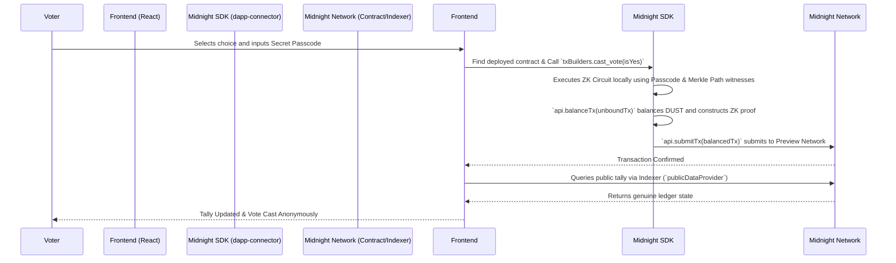
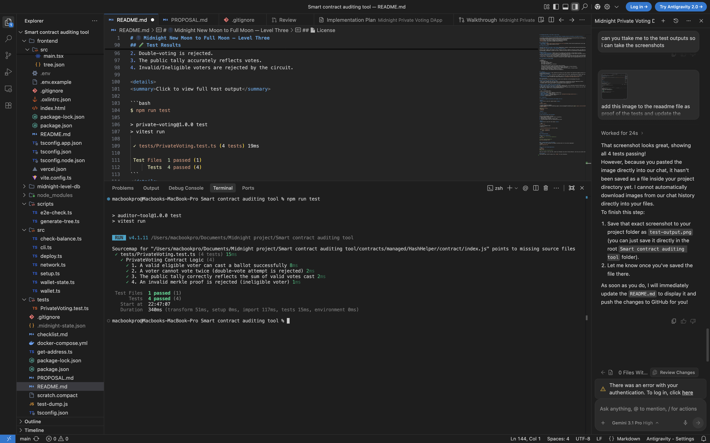

# 🌑 Midnight New Moon to Full Moon — Level Three

> **A Private Voting dApp built on the Midnight Network: Anonymous ballots with publicly verifiable tallies.**

[](https://github.com/harshavardhanthite1011-png/Smart-Contract-Auditing-tool/actions/workflows/ci.yml)


## 📌 Submission Links
- **Live Demo**: [https://smart-contract-auditing-tool.vercel.app](https://smart-contract-auditing-tool.vercel.app)
- **Demo Video**: [Watch the Demo on Loom](https://www.loom.com/share/83c5930f3e9a4a26b318b5dca39275cd)

## 🌐 Midnight Network Deployment (Preview)
- **Contract Address:** `9f51d1be135207f5c9c9cabd1c2e387e3e24fcab9a7a6ad094523e560ae81f87`
- **Network:** Preview Testnet

## 📖 About the Project

**Midnight New Moon to Full Moon — Level Three** demonstrates a complete, production-grade decentralized application for Private Voting leveraging the **Midnight Network's Zero-Knowledge capabilities**. 

Voting on public ledgers often exposes a voter's identity and choice, leading to coercion or bribery. This dApp solves that by using Zero-Knowledge cryptography to protect the voter's identity and choice while still guaranteeing a mathematically proven, public tally.

### How it works:
- **Merkle Tree Allowlisting:** A Merkle root of all eligible voter passcodes is stored publicly on-chain.
- **Private State & Witnesses:** Voters generate a Zero-Knowledge proof locally in their wallet using their secret passcode and Merkle path. The proof verifies they are in the allowlist without revealing *who* they are.
- **Nullifier Protection:** The contract computes a unique, deterministic nullifier from the voter's secret passcode using Midnight's `persistentHash`. This nullifier is stored publicly to prevent double-voting, but cannot be traced back to the voter.
- **Public Tally:** The vote choice (Yes/No) is recorded on the public ledger state, incrementing the tally in a verifiable way.

## 🏛 Architecture & Privacy Model (Genuine Midnight Integration)



## ✨ Features
- **Zero-Knowledge Privacy**: Voter identities and choices are never exposed. Proof generation happens entirely on the client side using the Midnight Wallet extension.
- **Genuine Testnet Integration**: Uses `@midnight-ntwrk/midnight-js-contracts` to natively build, balance, and submit transactions to the Midnight Preview Network.
- **Double-Voting Prevention**: Nullifiers are computed inside the ZK circuit, guaranteeing each eligible voter can only cast exactly one ballot.
- **Verifiable Tally**: The frontend fetches the live, verifiable tally directly from the public indexer state (`publicDataProvider`), removing the need for local simulated mocks.
- **Real-Time UI**: React frontend that connects seamlessly via `@midnight-ntwrk/dapp-connector-api`.

## 🔒 Privacy Model
This application uses the Midnight Network to protect voter identities via Zero-Knowledge (ZK) proofs.

### What an observer CAN learn (Public State)
- That a valid, eligible voter has cast a ballot (represented by a deterministic nullifier appearing on-chain).
- The overall public tally of the proposal (e.g., how many total Yes and No votes exist).
- The Merkle root of the eligible voters (to mathematically prove eligibility).

### What an observer CANNOT learn (Private Witnesses)
- **Which specific voter cast the ballot.** The voter's identity (their secret passcode and specific Merkle path) is kept entirely local as a private witness. Observers cannot map a nullifier back to the voter.
- **Which option a specific voter chose.** Because identities are hidden behind nullifiers, observers only see "Nullifier X voted Yes", but they CANNOT learn whether Alice or Bob generated Nullifier X.

## 🛠 Tech Stack

| Layer | Technologies Used |
|-------|-------------------|
| **Frontend** | React, Vite, TypeScript, Vanilla CSS |
| **Smart Contract** | Compact (v0.5.1) |
| **Wallet Integration** | Midnight DApp Connector API (`@midnight-ntwrk/dapp-connector-api`) |
| **Testing** | Vitest (TypeScript runner) |
| **CI/CD** | GitHub Actions |

## ⚙️ Compilation

✅ **Contracts compiled successfully with Compact v0.5.1**

<details>
<summary>Click to view full compile output</summary>

```bash
$ npm run compile

> private-voting@1.0.0 compile
> compact compile contracts/PrivateVoting.compact contracts/managed/PrivateVoting && compact compile contracts/HashHelper.compact contracts/managed/HashHelper

Compiling 2 circuits:
- cast_vote
- hash_pair
```
</details>

## 🧪 Test Results

✅ **4/4 contract-level tests passing**



The test suite thoroughly verifies:
1. Valid eligible voters can cast a ballot successfully.
2. Double-voting is rejected.
3. The public tally accurately reflects votes.
4. Invalid/Ineligible voters are rejected by the circuit.

<details>
<summary>Click to view full test output</summary>

```bash
$ npm run test

> private-voting@1.0.0 test
> vitest run

 ✓ tests/PrivateVoting.test.ts (4 tests) 19ms

 Test Files  1 passed (1)
      Tests  4 passed (4)
```
</details>

## 🏁 Getting Started

### 1. Install Dependencies
```bash
# Install root (contract/SDK) dependencies
npm install

# Install frontend dependencies
cd frontend && npm install
```

### 2. Generate Merkle Tree (Off-Chain)
Generates the voter passcodes and computes the Merkle Root for the contract deployment.
```bash
npm run generate-tree
```

### 3. Deploy to Testnet
Deploy the `PrivateVoting.compact` contract to the Midnight Preview testnet using the provided script.
```bash
npm run deploy -- --network preview
```
**Deployed Contract Address (Preview Network):**
`c52e53be5234153562e71b753687ea3dc4286e8b684d63f866c46402eff82d05`

**Deployment Transaction Hash:**
`e0d611ed0b4eeda1d73b74cd4a3ad26a28d1a1f4ca1b4405ba8cd77fd6f80936`

### 4. Start the Frontend Application
Ensure you set your deployed contract address inside `frontend/.env`:
```
VITE_NETWORK=preview
VITE_CONTRACT_ADDRESS=c52e53be5234153562e71b753687ea3dc4286e8b684d63f866c46402eff82d05
```

```bash
cd frontend
npm run dev
# Starts on http://localhost:5175
```
Open your browser to the local URL, connect your Midnight Lace wallet (Preview Network), and cast your private vote!

## 📄 License
Distributed under the MIT License. See `LICENSE` for more information.
