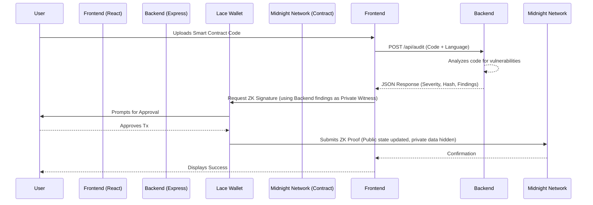

# 🌑 Midnight New Moon to Full Moon — Level One

> **An end-to-end, full-stack, AI-assisted Universal Smart Contract Auditing platform built on the Midnight Network.**


## 📌 Submission Links
- **Live Demo**: [https://smart-contract-auditing-tool-hhy3b3ftk-vardhan20.vercel.app](https://smart-contract-auditing-tool-hhy3b3ftk-vardhan20.vercel.app)
- **Demo Video**: [To be added by user (Wallet Connect + Successful Circuit Call)]
- **Contract Address**: `d088a2fdff8a35c4ca84486ef61b527516b81a98b5ee5af799eb499af44eda78` (Midnight Preview)

## 📖 About the Project

**Midnight New Moon to Full Moon — Level One** demonstrates a complete, end-to-end decentralized application leveraging the **Midnight Network's Zero-Knowledge capabilities**. The application acts as a secure auditing engine that evaluates smart contracts written in any language (Solidity, Rust, Move, Cairo). 

The platform protects sensitive vulnerability data using Zero-Knowledge proofs. When a user audits a contract:
- The existence of the audit and the overall severity are stored **publicly** on-chain.
- The precise vulnerability code and the exploit details are kept **strictly private** as Zero-Knowledge witnesses.
- The contract includes a `disclose` mechanism, allowing the auditor to explicitly reveal the vulnerability on the ledger only after the development team has issued a patch.

## 🏛 Architecture / Integration Flow



### Written Walkthrough
1. **Frontend ⇄ Backend API**: The user interacts with the React UI, pasting their contract. The frontend sends an HTTP `POST` request to the Express backend (`/api/audit`).
2. **Backend ⇄ Frontend**: The Express API simulates an AI auditing engine, detecting vulnerabilities like insecure delegation. It returns a severity score and the detailed findings back to the frontend.
3. **Frontend ⇄ Wallet**: The React app invokes the Midnight `@midnight-ntwrk/dapp-connector-api` to connect to the user's Lace Wallet, requesting an on-chain execution of the `submit_audit` circuit using the backend's data.
4. **Wallet ⇄ Smart Contract**: The wallet constructs the Zero-Knowledge DUST proof locally, masking the private findings, and submits the transaction to the `ContractAuditor` smart contract deployed on the Midnight Preview testnet.

## ✨ Features
- **Multi-Language Support**: Capable of ingesting Solidity, Rust, Move, and Cairo.
- **Full-Stack Integration**: Complete data lifecycle from React UI, through an Express analysis API, and onto the blockchain.
- **Zero-Knowledge Privacy**: Stores vulnerabilities locally as private witnesses; verifies them on-chain without exposing the exploit code to MEV bots.
- **Selective Disclosure**: Auditors maintain full control over when to release findings to the public state using the `.disclose()` circuit.

## 🔒 Privacy Claim
This application uses the Midnight Network to protect sensitive vulnerability data via Zero-Knowledge (ZK) proofs. When a user submits an audit, only the **audit existence, contract hash, and overall severity score** are stored on the public blockchain state. The actual **vulnerability details, exploit paths, and sensitive code snippets** are kept entirely local as a private witness during the ZK circuit execution. This ensures that no malicious actors (like MEV bots or black-hat hackers) can front-run or exploit the discovered vulnerabilities before the development team has a chance to deploy a patch. The auditor retains cryptographic control to explicitly `.disclose()` the findings on-chain at a later time.

## 🛠 Tech Stack

| Layer | Technologies Used |
|-------|-------------------|
| **Frontend** | React, Vite, TypeScript, Vanilla CSS |
| **Backend API** | Node.js, Express.js, TypeScript, CORS |
| **Smart Contract** | Compact (v0.5.1) |
| **Wallet Integration** | Midnight DApp Connector API (`@midnight-ntwrk/dapp-connector-api`) |
| **Testing** | Vitest (TypeScript runner) |

## ⚙️ Compilation

✅ **2 circuits compiled successfully with Compact v0.5.1**

<details>
<summary>Click to view full compile output</summary>

```bash
$ compact --version
compact 0.5.1

$ npm run compile

> auditor-tool@1.0.0 compile
> compact compile contracts/ContractAuditor.compact contracts/managed/ContractAuditor

Compiling 2 circuits:
```
</details>

## 🧪 Test Results

✅ **3/3 tests passing prominently**

<details>
<summary>Click to view full test output</summary>

```bash
$ npm run test

> auditor-tool@1.0.0 test
> vitest run


 RUN  v4.1.11 /Users/macbookpro/Documents/Midnight project/Smart contract auditing tool

 ✓ tests/ContractAuditor.test.ts (3 tests) 78ms

 Test Files  1 passed (1)
      Tests  3 passed (3)
   Start at  16:55:54
   Duration  441ms (transform 70ms, setup 0ms, import 49ms, tests 78ms, environment 0ms)
```
</details>

## 🚀 Deployed Contract

| Network | Contract Name | Contract Address | Deployer Wallet Address |
|---------|---------------|------------------|-------------------------|
| Midnight Preview | `ContractAuditor` | `d088a2fdff8a35c4ca84486ef61b527516b81a98b5ee5af799eb499af44eda78` | `mn_addr_preview1muf76nxyppjan4yezlpgfwfc47c399zfy3a0wgf6yhq4tx90wctsgmwc9g` |

*(Note: Midnight Network block explorers are currently internal/CLI-based during the Preview phase)*

## 🏁 Getting Started

### 1. Install Dependencies
```bash
# Install root (contract/SDK) dependencies
npm install

# Install frontend dependencies
cd frontend && npm install

# Install backend dependencies
cd ../backend && npm install
```

### 2. Start the Backend API
```bash
cd backend
npm run dev
# Starts on http://localhost:3001
```

### 3. Start the Local Proof Server
*(Required for local Zero-Knowledge proving before transaction submission)*
```bash
npm run proof-server:start
```

### 4. Start the Frontend Application
```bash
cd frontend
npm run dev
# Starts on http://localhost:5175
```
Open your browser to the local URL, connect your Midnight Lace wallet (Preview Network), and submit your smart contracts for a secure, zero-knowledge audit!

## 📄 License
Distributed under the MIT License. See `LICENSE` for more information.
